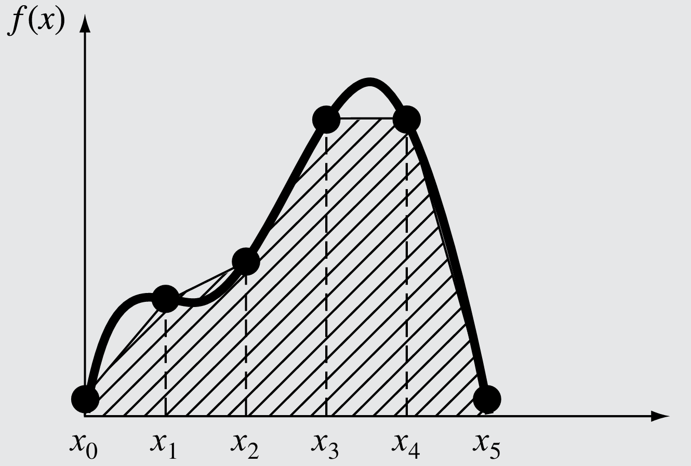

# INTEGRACIÓN NUMÉRICA

## 1. Introducción
La integral definida de una función no siempre se puede calcular usando el teorema fundamental del calculo porque hay funciones que no tienen primitiva elemental, es decir la integral indefinida no se puede expresar en terminos de <a href="#N1">funciones elementales1</a>.

**Ejemplo**

$$\int e^{x^2}dx$$

$$\int \frac{\sin(x)}{x}dx$$

$$\int \frac{\cos(x)}{x}dx$$

$$\int \frac{e^x}{x}dx$$

Para resolver este tipo de integrales, las <a href="#N2">fórmulas de Newton-Cotes2</a> son los tipos de integración más comunes. Se basan en la estrategia de reemplazar una función complicada o datos tabulados por un polinomio de aproximación que es fácil de integrar:

$$I = \int_{a}^{b}f(x)dx \cong \int_{a}^{b}f_n(x)dx$$

$\cong$: <a href="#N3">Congruencia3</a>

donde $f_n(x)$ es un polinomio de la forma:

$$f_n(x)=a_0 + a_1x + a_2x^2 + \cdots + a_{n-1}x^{n-1} + a_nx^n$$

La integral se puede aproximar utilizando un polinomio de primer grado _(una linea recta)_ **Figura 1.1 a)**, como también se puede aproximar usando un conjunto de polinomios aplicados por pedazos a la función o datos, sobre segmentos de longitud constante **Figura 1.1 b)**.

Existen formas cerradas y abiertas de las fórmulas de Newton-Cotes.   

* Las formas cerradas son aquellas donde se conocen los datos al inicio y al final de los límites de integración **Figura 1.2 a)**.  

* Las formas abiertas tienen límites de integración que se extienden más allá del intervalo de los datos **Figura 1.2 b)**.

En este informe se hara énfasis en 2 de las formas cerradas de las formulas de Newton-Cotes.

## 2. Regla del Trapecio

La regla del trapecio es la primera de las fórmulas cerradas de integración de Newton-Cotes. Corresponde al caso donde el polinomio de aproximación es de primer grado:

$$I = \int_{a}^{b}f(x)dx \cong \int_{a}^{b}f_1(x)dx$$

Recordando que una línea recta se puede representar como:

$$f(x) = f(a) + \frac{f(b)-f(a)}{b-a}(x-a)$$

El área bajo esta línea recta es una aproximación de la integral de $f(x)$ entre los límites $a$ y $b$:

$$I = \int_{a}^{b}\left[ f(a) + \frac{f(b)-f(a)}{b-a}(x-a) \right]dx$$

$$I = \int_{a}^{b}\left[ f(a) + x\frac{f(b)-f(a)}{b-a} - a\frac{f(b)-f(a)}{b-a} \right]dx$$

$$I = \int_{a}^{b}\left[ x\frac{f(b)-f(a)}{b-a} + f(a) - a\frac{f(b)-f(a)}{b-a} \right]dx$$

$$I = \int_{a}^{b}\left[ x\frac{f(b)-f(a)}{b-a}  + \frac{f(a)(b-a)-a(f(b)-f(a))}{b-a} \right]dx$$

$$I = \int_{a}^{b}\left[ x\frac{f(b)-f(a)}{b-a}  + \frac{bf(a)-af(a)-af(b)+af(a)}{b-a} \right]dx$$

$$I = \int_{a}^{b}\left[ x\frac{f(b)-f(a)}{b-a}  + \frac{bf(a)-af(b)}{b-a} \right]dx$$

$$I = \int_{a}^{b} x\frac{f(b)-f(a)}{b-a}dx  + \int_{a}^{b}\frac{bf(a)-af(b)}{b-a}dx$$

$$I = \frac{f(b)-f(a)}{b-a}\int_{a}^{b} xdx  + \frac{bf(a)-af(b)}{b-a}\int_{a}^{b}dx$$

$$I = \frac{f(b)-f(a)}{b-a}\frac{x^2}{2}\bigg|_a^b  + \frac{bf(a)-af(b)}{b-a}x\bigg|_a^b$$

$$I = \frac{f(b)-f(a)}{b-a}\left(\frac{b^2}{2}-\frac{a^2}{2}\right)  + \frac{bf(a)-af(b)}{b-a}(b-a)$$

$$I = \frac{f(b)-f(a)}{b-a}\frac{(b^2-a^2)}{2}  + \frac{bf(a)-af(b)}{\cancel{b-a}}\cancel{(b-a)}$$

$$I = \frac{f(b)-f(a)}{\cancel{b-a}}\frac{\cancel{(b-a)}(b+a)}{2}  + \left[bf(a)-af(b)\right]$$

$$I = \left[f(b)-f(a)\right]\frac{(b+a)}{2}  + bf(a)-af(b)$$

$$I =\frac{bf(b)+af(b)-bf(a)-af(a)}{2}+ bf(a)-af(b)$$

$$I =\frac{bf(b)+af(b)-bf(a)-af(a)+2bf(a)-2af(b)}{2}$$

$$I =\frac{bf(b)-af(a)+bf(a)-af(b)}{2}$$

$$I =\frac{b[f(a)+f(b)]-a[f(a)+f(b)]}{2}$$

$$I =\frac{(b-a)[f(b)+f(a)]}{2}$$

$$I =\frac{b-a}{2}[f(a)+f(b)]$$

con $h = b-a$ se tiene:

$$I =\frac{h}{2}[f(a)+f(b)]$$

que es la fórmula para la regla del trapecio.

### 2.1. La regla del trapecio de aplicación múltiple

Una forma de mejorar la precisión de la regla del trapecio consiste en dividir el intervalo de integración de $a$ a $b$ en varios segmentos, y aplicar el método a cada uno de ellos.

Las áreas de los segmentos se suman después para obtener la integral en todo el intervalo. Las ecuaciones resultantes se llaman fórmulas de integración, de aplicación múltiple o compuestas.

Hay $n + 1$ puntos igualmente espaciados $(x_0, x_1, x_2, \cdots, x_n)$. En consecuencia, existen n segmentos del mismo ancho:

$$h = \frac{b-a}{n}$$

**Formato general y nomenclatura para integrales de aplicación múltiple**

Si $a$ y $b$ se designan como $x_0$ y $x_n$, respectivamente, la integral completa se representará como 

$$I = \int_{x_0}^{x_1}f(x)dx + \int_{x_1}^{x_2}f(x)dx + \cdots + \int_{x_{n-1}}^{x_n}f(x)dx$$

Sustituyendo la regla del trapecio en cada integral se obtiene:

$$I = \frac{h}{2}[f(x_0)+f(x_1)] + \frac{h}{2}[f(x_1)+f(x_2)] + \cdots + \frac{h}{2}[f(x_{n-1})+f(x_n)]$$

agrupando terminos, se tiene:

$$I = \frac{h}{2}\left[f(x_0) + f(x_1) + f(x_1) + f(x_2) + \cdots + 2f(x_{n-1}) + f(x_n)\right]$$

$$I = \frac{h}{2}\left[f(x_0) + 2f(x_1) + 2f(x_2) + \cdots + 2f(x_{n-1}) + f(x_n)\right]$$

$$I = \frac{h}{2}\left[f(x_0) + 2\sum_{i=1}^{n-1}f(x_i) + f(x_n)\right]$$

## 3. Regla de Simpson 1/3

Otra forma de obtener una estimación más exacta de una integral consiste en usar polinomios de grado superior para unir los puntos. En vez de usar interpolación lineal, se hará uso de interpolación cuadrática buscando una mejora en el cálculo. Para construir la parábola que interpola $f$ se necesitan los puntos $x_0, x_1$ y $x_2$.

La regla de **Simpson 1/3** resulta al integrar un polinomio de interpolación de segundo grado:

$$I = \int_{a}^{b}f(x)dx \cong \int_{a}^{b}f_2(x)dx$$

Si se designan $a$ y $b$ como $x_0$ y $x_2$, y $f_2(x)$ se representa por un polinomio de Lagrange de segundo grado, la integral se transforma en:

$$I = \int_{x_0}^{x_2}\left[\frac{(x-x_1)(x-x_2)}{(x_0-x_1)(x_0-x_2)}f(x_0)+\frac{(x-x_0)(x-x_2)}{(x_1-x_0)(x_1-x_2)}f(x_1)+\frac{(x-x_0)(x-x_1)}{(x_2-x_0)(x_2-x_1)}f(x_2)\right]dx$$

Después de la integración y de las manipulaciones algebraicas, se obtiene la siguiente fórmula:

$$I = \frac{h}{3}\left[f(x_0)+4f(x_1)+f(x_2)\right]$$

donde $h=\frac{b-a}{2}$.

### 3.1. La regla de Simpson 1/3 de aplicación múltiple

Así como en la regla del trapecio, la regla de Simpson se mejora al dividir el intervalo de integración en varios segmentos de un mismo tamaño:

$$h=\frac{b-a}{n}$$

La integral total se puede representar como:

$$I = \int_{x_0}^{x_2}f(x)dx + \int_{x_2}^{x_4}f(x)dx + \cdots + \int_{x_{n-2}}^{x_n}f(x)dx$$

Al sustituir la regla de Simpson 1/3 en cada integral se obtiene:

$$I = \frac{h}{3}\left[f(x_0)+4f(x_1)+f(x_2)\right]+\frac{h}{3}\left[f(x_2)+4f(x_3)+f(x_4)\right]+\frac{h}{3}\left[f(x_4)+4f(x_5)+f(x_6)\right]+\cdots+\frac{h}{3}\left[f(x_{n-2})+4f(x_{n-1})+f(x_n)\right]$$

agrupando y combinando terminos, se tiene:

$$I = \frac{h}{3}\left[f(x_0)+4f(x_1)+f(x_2)+f(x_2)+4f(x_3)+f(x_4)+f(x_4)+4f(x_5)+f(x_6)+\cdots+f(x_{n-2})+4f(x_{n-1})+f(x_n)\right]$$

$$I = \frac{h}{3}\left[f(x_0)+4f(x_1)+2f(x_2)+4f(x_3)+2f(x_4)+4f(x_5)+2f(x_6)+\cdots+2f(x_{n-2})+4f(x_{n-1})+f(x_n)\right]$$

$$I = \frac{h}{3}\left[f(x_0)+4\sum_{i=0}^{n-1}f(x_{2i+1})+2\sum_{i=1}^{n-2}f(x_{2i})+f(x_n)\right]$$

## 4. Aplicación Práctica

Se está estudiando el flujo de agua en un río para evaluar su capacidad de desagüe y el riesgo de inundaciones. Se ha medido el caudal de agua en diferentes momentos a lo largo de un día, pero no se tiene un modelo matemático claro que describa cómo varía el caudal a lo largo del tiempo.

Los datos del caudal de agua en el río son los siguientes (en metros cúbicos por segundo, m³/s):

|Tiempo (horas)|Caudal (m³/s)|
|:-:|:-:|
|0	|10 |
|1	|12 |
|2	|15 |
|3	|18 |
|4	|20 |
|5	|22 |
|6	|25 |
|7	|30 |
|8	|28 |
|9	|25 |
|10 |20 |
|11 |15 |
|12 |12 |

**Objetivo:**

Calcular el volumen total de agua que fluye por el río durante ese día

**Solución:**

**Resultados:**
El volumen total de agua que fluyo durante las 12 horas de ese día fueron aproximadamente:

* **Metodo del Trapecio:** $867,600m^3$

* **Metodo de Simpson 1/3:** $871,200m^3$

**Interpretación del resultado:**

El área bajo la curva representa el volumen total de agua que ha fluido por el río durante esas 12 horas, en metros cúbicos. Este valor es crucial para la planificación de la gestión de recursos hídricos y la evaluación del riesgo de inundaciones.

# NOTAS

1. _Una función elemental es una función construida a partir de una cantidad finita de funciones elementales fundamentales y constantes mediante operaciones racionales (adición, sustracción, multiplicación y división) y la composición de funciones. Usando exponenciales, logarítmicas, potenciales, constantes, y las funciones trigonométricas y sus inversas, todas consideradas dentro del grupo de funciones elementales fundamentales._

2. _Formulas de Newton-Cotes (nombradas así por Isaac Newton y Roger Cotes) son un grupo de fórmulas de integración numérica de tipo interpolatorio, en las cuales se evalúa la función en puntos equidistantes, para así hallar un valor aproximado de la integral._

3. _Dos o más figuras son congruentes si se cumple que son equivalentes tanto en forma como en tamaño, es decir si sus lados y sus ángulos respectivos tienen la correspondiencia en la medida, aunque su posición y orientación sean distintas._

# REFERENCIAS

Steven C. Chapra, Rymond P. Canale (2015). MÉTODOS NUMÉRICOS (7ma ed.). (p. 471).

Walter Mora F. (2016). MÉTODOS NUMÉRICOS (1ra ed.). (p. 166).